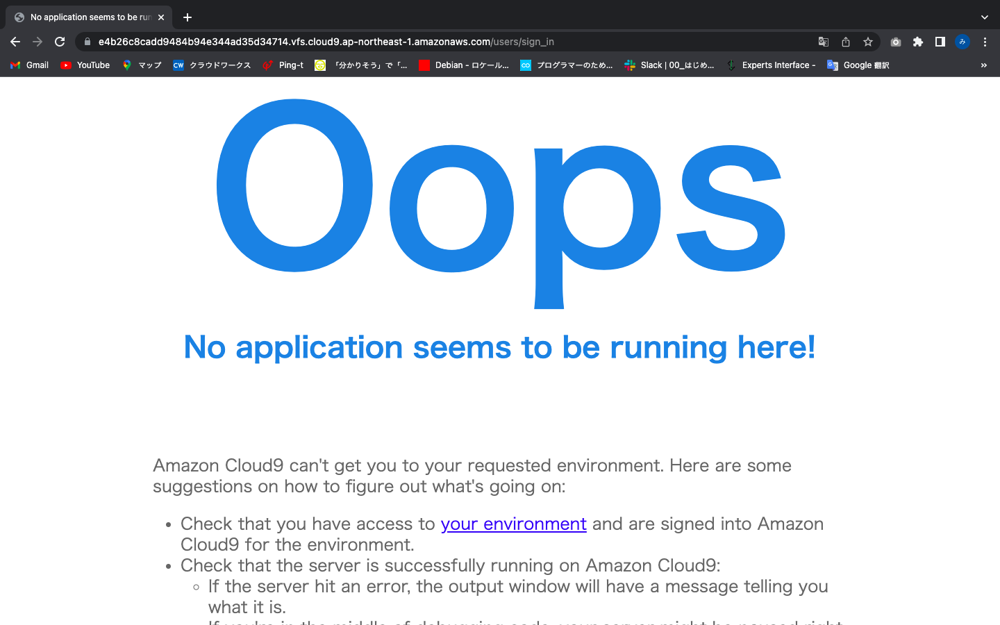

# lecture.03について

### アプリの起動確認

### APサーバ停止後

#### APサーバのバージョン
puma version 5.5.2

### DBサーバ停止後

#### DBサーバのバージョン
mysql  Ver 8.0.32 for Linux on x86_64

### Railsの構成管理ツール
Bundler
(Rubyで使われるライブラリやアプリケーションはGem形式というパッケージによって管理される。
そのGemパッケージを管理したり、必要なGemパッケージをインストールしたりするのに必要になるのがBundler)

### 感想
cloud9上にrails環境を構築するのは2回目なので、前回よりもスムーズにできたと思います。
1回目は構築するのに必死で、一つ一つの用語に対する理解も足りない部分が多かったのでそういった部分も含めて
復習できました。
構築以外の部分としてgithubの使い方など理解が足りてない部分が多いのでしっかり勉強していきたいです。
