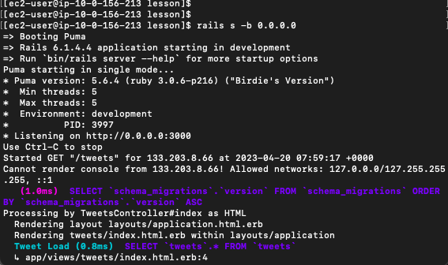
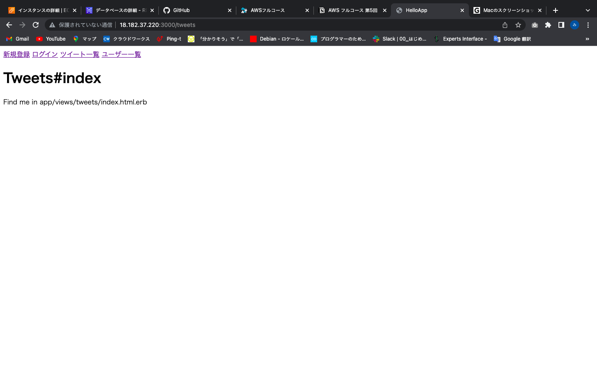
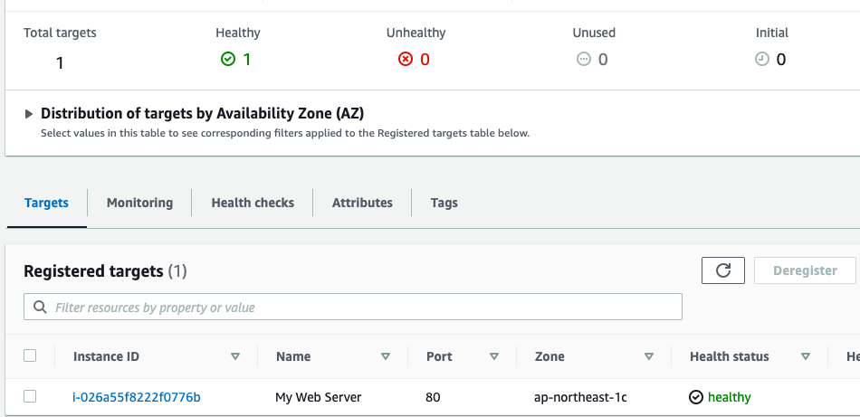
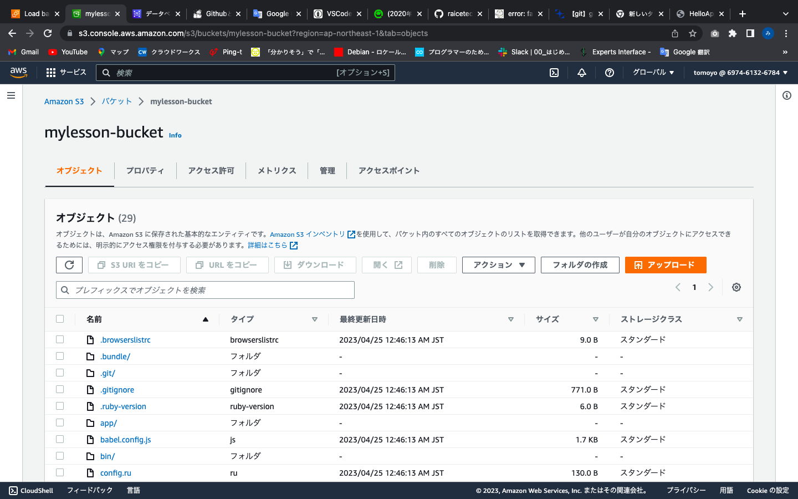

# lecture.05について

## 組み込みサーバでアプリを起動

### ターミナル

### ブラウザ

## nginx,unicornでアプリを起動

### ターミナル

### ブラウザ

## ALB追加

### ALB_healthyチェック後

### ブラウザ

## S３追加

### ec2とS3連携

連携にはS3エンドポイントを使用しました。

### コンソール画面

今回の課題でのS3の用途について、アプリケーションのバックアップ取得のためにS3を利用するという形で構築環境に組み込みました。
ec2とS3の連携、S3のバケット内のデータとEC2内のアプリケーションデータが相違ないように同期するようにしました。

### 環境構築の構成図

### 感想
環境構築がかなり手強かったです。エラーに対してもただコピペするのではなく、エラーログを確認して、どこを調べるか見当をつけたり
nginx,unicornの設定ファイルを作成する際も、どの部分がnginxとunicornの連携に必要なのか・・など周辺知識も必要な程度で
調べるように癖づけました。
ALB、S3など触ったことがないサービスや未だ苦手なgithub関連のエラーなどいろいろありましたが、課題を通して資格勉強で身につけた知識を
体系的に学べたので理解を深められた気がします。
