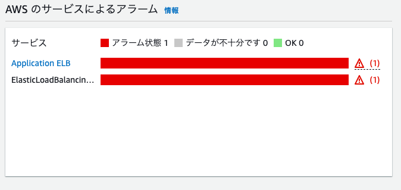

# lecture06について

### cloudtrailのログを確認して

イベント名,

DescribeAlarms(アラームの説明)

含まれている情報,

イベントが起きた時間,ユーザー名,発信元のIPアドレス

### cloudwatchアラーム設定について

・アプリケーションを起動した際のOKアクション

AmazonSNSに紐づけたメールアドレスにOKアラートが通知されました。

・アプリケーションの起動を停止した際のアラート

紐づけたメールアドレスにunhealthyアラートが通知されました。

### 料金確認

先月のEC2インスタンスの料金
46円

今月はまだ無料期間枠に収まっています。

### 見積り書
AWS Pricing Calculatorを使用して作成しました。今までに使用してきたリソースの使用量を参考に作成しました。

https://calculator.aws/#/estimate?id=01b796bfd3d6d603a424d1cf0ed3a242efe5a1b0

### 感想
cloudtrail、cloudwatchについて実際にサービスを扱ってみたり、ログを確認したことで今まで資格勉強の為に文字で覚えたサービスの理解を深めることができました。

見積書についてこういった書類を作成することも初なので少し手こずりました。自分で作成してきた環境について、無料枠を使用していることもあって実感が少し湧きづらかったですが、お金に換算すると結構かかっているんだなと思いました。
