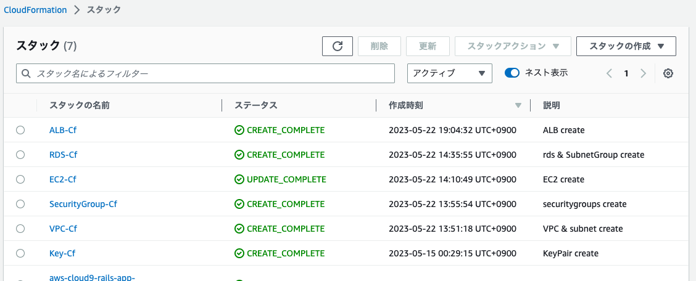

# lecture.10について

今回の課題のテンプレートファイルはCloudFormationファイルにまとめています。

### 作成したリソース
ALB,EC2,RDS,VPC(subnet含め),キーペア,セキュリティグループ

### 感想
エラーがフワッとしていてとても分かりにくかったのでエラー対処が大変だと感じました。
ただ、システムサービスとしてとても便利だと思いました。少し作成に時間がかかるリソースはありますがGUIで、ぽちぽちやるよりコードでサクッと書いた方が細かい設定とかに関しては楽なんだろうなと思いました。
今回の課題について、コードを書くということで少し楽しみに思いつつも、結構身構えていた課題でもあったので、提出まで到達できてよかったです。

コードよりもcloudformationで作成したキーペアでの接続まわりの方が大変だったかもしれません。。ssh接続をするために権限を選んでポリシー、ロールを作成してみました。勉強したつもりになっていた部分を実際自分で作成することでどこか腹落ち？しっくりきた感じがします。