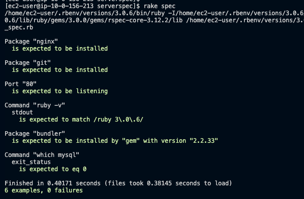

# lecture.11について

sample_spec.rbが今回の課題のテストファイルです。

### test結果

### 感想
serverspec公式がとても丁寧なので導入もテストも思ったよりスムーズにできました。
いちいちパッケージやポートの接続確認をひとつひとつ確認しなくてもテストを用意して一気にできるのは効率的だと思いました。

####ただのメモ
Rspec..rubyのプログラム専用に作られた自動テスト作成ツール
Serverspec..Rspecからできた？派生したツール