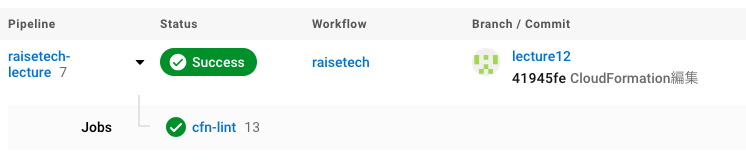

# lecture.12について

CircleCIのconfテストについて。。
CloudFormationディレクトリ内のyml構文チェックを行いました。

### test結果

#### confテストで引っかかったところ。。

エラー。。
rdsのマスターパスとAvailabilityZone名をハードコードするなと指摘された。

対処法。。
rdsのマスターパスはSSMのパラメーターストアを使用、
AvailabilityZone名はSelect関数を使用した。

### 感想
上記のエラー以外にも細かなエラーは出ていましたが、自分では問題ないと思っていた構文も思わぬところに直しそびれたミスがあったり、案外気がつかないところのミスを検出してくれるのでとても便利だと思った。

ただ、confファイルテストはgithubにいちいちプルリクエストを発行しないといけないのでlocalでテストできるように環境構築した方がいいなとは思ったが、実際どのくらいパソコンのリソースを食べるんだろう。。それで重くなったら意味ないしな。。
あと、confファイルテストで何回も弾かれるの少しきついと思ってしまった。